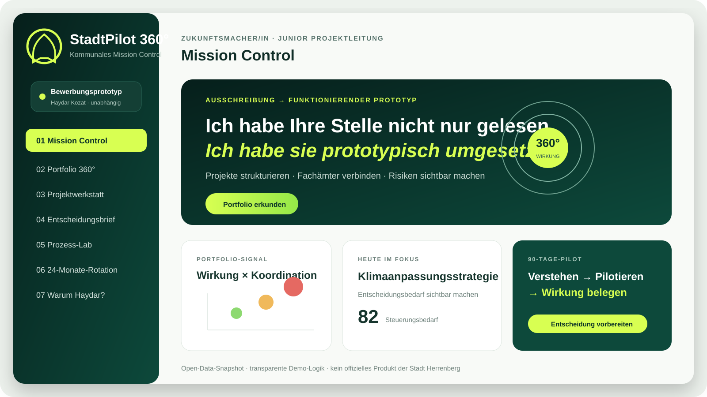

# StadtPilot 360° – Kommunales Mission Control

> **Unabhängiger Bewerbungsprototyp von Haydar Kozat. Kein offizielles Produkt der Stadt Herrenberg.**

**StadtPilot 360°** ist eine interaktive Arbeitsprobe für die Position **„Zukunftsmacher/in im technischen Bereich – Junior Projektleitung (w/m/d)“**. Der Prototyp übersetzt öffentlich zugängliche Herrenberger Projektinformationen in ein kommunales Portfolio-, Projekt-, Entscheidungs- und Prozesscockpit.

[](https://haydarkozat.github.io/stadtpilot360-herrenberg/)
[](https://github.com/haydarkozat/stadtpilot360-herrenberg/actions/workflows/pages.yml)
[](LICENSE)

## Live-Demo

**[StadtPilot 360° im Browser öffnen →](https://haydarkozat.github.io/stadtpilot360-herrenberg/)**

Die Anwendung läuft vollständig clientseitig und benötigt weder Anmeldung noch Installation.




## Warum dieses Projekt zur Stelle passt

Die Arbeitsprobe macht zentrale Anforderungen der Ausschreibung direkt sichtbar:

- **Themenvielfalt:** elf reale Vorhaben werden vier möglichen Rotationsfeldern zugeordnet.
- **Eigeninitiative:** Die Stellenausschreibung wurde nicht nur analysiert, sondern in einen funktionsfähigen Prototyp übersetzt.
- **Fachämterübergreifende Zusammenarbeit:** Stakeholder-Matrix, RACI, Risiken und Aktionsboard bilden Schnittstellen und Entscheidungswege ab.
- **Strukturiertes Projektmanagement:** Projektauftrag, Steuerungsbedarf, 90-Tage-Pilot und klar definierte Lieferobjekte.
- **Gremien- und Leitungskommunikation:** Ein dynamischer, druckbarer Management-One-Pager verdichtet komplexe Inhalte.
- **Digitalisierung und Prozessoptimierung:** Das Prozess-Lab macht Annahmen, Kapazitätspotenzial und Amortisation interaktiv messbar.
- **24-Monate-Trainee-Logik:** Vier Stationen verbinden Stadt & Raum, Technik & Klima, Bildung & Teilhabe sowie Digital & Prozess.

## Die sieben Ansichten

1. **Mission Control** – Bewerbungsstory, Portfolio-Signal und heutiger Fokus
2. **Portfolio 360°** – Suche, Filter, Vergleich, vereinfachte Projektkarte
3. **Projektwerkstatt** – Project Charter, Stakeholder & RACI, Risiken, Aktionsboard
4. **Entscheidungsbrief** – automatisch erzeugter Management-One-Pager
5. **Prozess-Lab** – veränderbare Annahmen und Business-Case-Szenarien
6. **24-Monate-Rotation** – vier Lern- und Wirkungsstationen plus 90-Tage-Startmission
7. **Warum Haydar?** – Anforderung-zu-Beleg-Mapping und 90-Sekunden-Pitch

## Demo starten

### Schnellster Weg: eine Datei

`StadtPilot360_Premium_Standalone.html` doppelklicken. CSS, JavaScript und Projektdaten sind vollständig eingebettet; eine Installation ist nicht erforderlich.

### Modulare Entwicklungsversion

```bash
python3 -m http.server 8080
```

Danach im Browser öffnen:

```text
http://localhost:8080
```

## Datenintegrität

Der Prototyp trennt zwei Ebenen sichtbar voneinander:

### Offizielle beziehungsweise öffentlich zugängliche Quellfelder

- Projekttitel
- öffentliche Kurzbeschreibung
- Kategorie und Status
- Ortsteile beziehungsweise Gebietsbezug
- Aktualisierungsstand
- Link zur öffentlichen Projektquelle

### Transparente Demo-Annahmen

- Wirkung
- Dringlichkeit
- Koordinationskomplexität
- Datenreife
- Risikoklasse
- Stakeholder- und RACI-Modell
- Management-Lesart, Risiken und Entscheidungsempfehlung

Der demonstrative **Steuerungsbedarf** wird berechnet als:

```text
36 % Wirkung
26 % Dringlichkeit
24 % Koordinationskomplexität
14 % Risikogewicht
```

Diese Werte sind **keine amtliche Priorisierung**. In einem realen Projekt müssten Kriterien, Gewichtungen und Datenowner gemeinsam mit Sponsor, Fachämtern und Beteiligten validiert werden.

## Technische Architektur

- Vanilla HTML, CSS und JavaScript
- keine Frameworks und keine Build-Pipeline
- keine externen Bibliotheken
- keine Tracker und keine Telemetrie
- keine personenbezogenen Daten
- lokale Speicherung nur für ausgewähltes Projekt, Theme und Demo-Aktionsstatus
- responsive Darstellung für Desktop, Tablet und Smartphone
- separate Druckansicht für den Entscheidungsbrief

```text
index.html
├── assets/styles.css
├── assets/app.js
├── data/projects.js
├── assets/preview.svg
├── docs/
└── StadtPilot360_Premium_Standalone.html
```

## Qualitätsnachweis

Die Standalone-Version wurde automatisiert in Chromium geprüft:

- 11 Projektdatensätze geladen
- alle 7 Ansichten schaltbar
- Prozessrechner reagiert auf Eingabeänderungen
- kein horizontaler Overflow bei 390 px Breite
- keine JavaScript-Laufzeitfehler im Testlauf

Details: [`docs/QA_REPORT.md`](docs/QA_REPORT.md)

## Interview-Unterlagen

- [`90-Sekunden-Pitch`](docs/INTERVIEW_PITCH_DE.md)
- [`3-Minuten-Demo-Skript`](docs/DEMO_SCRIPT_DE.md)
- [`Formulierung für CV und Anschreiben`](docs/BEWERBUNG_SNIPPET_DE.md)
- [`Project Charter`](docs/PROJECT_CHARTER.md)
- [`Daten- und Scoring-Methodik`](docs/DATA_METHODIK.md)
- [`GitHub-Pages-Anleitung auf Türkisch`](docs/GITHUB_PAGES_TR.md)

## Leitgedanke

> **Nicht noch ein Dashboard bauen – sondern Informationen so strukturieren, dass Menschen schneller gemeinsam entscheiden und handeln können.**
